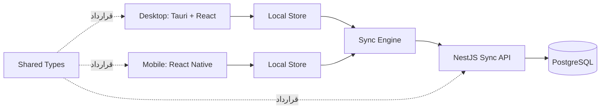

# معماری سیستم

## 1. اصول معماری

- **Local-first:** خواندن و تغییر داده‌های اصلی ابتدا از storage محلی انجام می‌شود.
- **قراردادمحوری:** مدل‌ها و payloadهای سینک در `shared-types` تعریف می‌شوند.
- **جداکردن دامنه از زیرساخت:** منطق merge و queue نباید به UI، HTTP یا دیتابیس خاص وابسته باشد.
- **قابلیت مشاهده:** هر عملیات سینک باید شناسه، وضعیت، تلاش و خطای قابل ردیابی داشته باشد.
- **تغییرپذیری کنترل‌شده:** تصمیم‌های معماری در ADR و تغییرات روزانه در `PROGRESS.md` ثبت می‌شوند.

## 2. نمای سطح بالا

## 3. اجزای سیستم

### `apps/desktop`

کلاینت Windows و Linux. UI با React و لایه native با Tauri پیاده‌سازی می‌شود. دسترسی به storage، شبکه و اعلان‌ها از طریق adapter انجام می‌شود.

### `apps/mobile`

کلاینت Android با React Native. جزئیات دیتابیس محلی نباید از دامنه و `sync-engine` به بیرون نشت کند.

### `apps/server`

NestJS مسئول احراز هویت آینده، اعتبارسنجی payload، اعمال mutationهای idempotent، نگهداری PostgreSQL و ارائه push/pull است.

### `packages/shared-types`

تعریف TypeScript برای entityها، mutationها، خطاها، cursor و پاسخ‌های API. این پکیج نباید به framework یا runtime خاصی وابسته باشد.

### `packages/sync-engine`

صف محلی، retry، backoff، idempotency، pull cursor و merge تعارض. ورودی آن interfaceهای storage و transport است.

### `packages/ui-system`

کامپوننت‌های مشترک UI بعد از تثبیت domain ساخته می‌شوند و نباید منطق سینک را در خود نگه دارند.

## 4. جریان تغییر محلی

1. UI فرمان ایجاد یا تغییر را به domain service می‌دهد.
2. domain service entity محلی را با UUIDv4 و `localStatus` مناسب ذخیره می‌کند.
3. همان تراکنش یک mutation در `sync_queue` ثبت می‌کند.
4. UI بلافاصله از local store داده را می‌خواند.
5. sync engine با اتصال شبکه mutation را ارسال می‌کند.
6. پاسخ سرور وضعیت mutation و version/cursor را به‌روزرسانی می‌کند.

ثبت entity و mutation باید اتمیک باشد؛ وجود entity بدون mutation یا mutation بدون entity وضعیت معتبر محسوب نمی‌شود.

## 5. جریان push/pull

- **Push:** mutationهای pending به ترتیب `createdAt` ارسال می‌شوند.
- **Pull:** کلاینت با cursor آخرین تغییرات سرور را دریافت می‌کند.
- **ترتیب پیشنهادی:** pull، merge محلی، push mutationهای باقی‌مانده، pull نهایی برای دریافت تغییرات هم‌زمان.
- **تکرار:** هر درخواست idempotency key دارد و پاسخ تکراری نباید داده جدید ایجاد کند.

## 6. مرزهای غیرمسئولیت

UI مسئول retry، merge یا تشخیص conflict نیست. API مسئول تصمیم‌گیری درباره نمایش نیست. دیتابیس محلی مسئول تعیین سیاست حل تعارض نیست. این رفتارها در sync engine و قرارداد سرور تعریف می‌شوند.

## 7. تصمیم‌های باز

- انتخاب adapter محلی بین SQLite و WatermelonDB.
- ORM و روش migration در NestJS.
- انتخاب transport برای sync نهایی: HTTP polling، WebSocket یا ترکیب آن‌ها.
