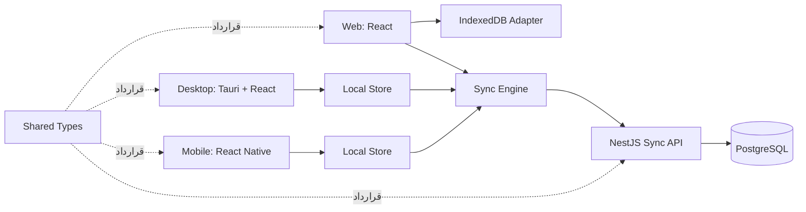

# معماری سیستم

## 1. اصول معماری

- **Local-first:** خواندن و تغییر داده‌های اصلی ابتدا از storage محلی انجام می‌شود.
- **قراردادمحوری:** مدل‌ها و payloadهای سینک در `shared-types` تعریف می‌شوند.
- **جداکردن دامنه از زیرساخت:** منطق merge و queue نباید به UI، HTTP یا دیتابیس خاص وابسته باشد.
- **قابلیت مشاهده:** هر عملیات سینک باید شناسه، وضعیت، تلاش و خطای قابل ردیابی داشته باشد.
- **تغییرپذیری کنترل‌شده:** تصمیم‌های معماری در ADR و تغییرات روزانه در `PROGRESS.md` ثبت می‌شوند.

## 2. نمای سطح بالا

## 3. اجزای سیستم

### `apps/web`

اولین کلاینت قابل استفاده و مرجع رفتاری محصول. UI، navigation، auth boundary و تجربه task/Pomodoro ابتدا در Web اعتبارسنجی می‌شوند. storage مرورگر از طریق adapter مستقل به sync engine متصل می‌شود و domain نباید مستقیماً به IndexedDB وابسته باشد.

### `apps/desktop`

کلاینت Windows و Linux. UI با React و لایه native با Tauri پیاده‌سازی می‌شود. دسترسی به storage، شبکه و اعلان‌ها از طریق adapter انجام می‌شود.

### `apps/mobile`

کلاینت Android با React Native. جزئیات دیتابیس محلی نباید از دامنه و `sync-engine` به بیرون نشت کند.

### `apps/server`

NestJS مسئول احراز هویت آینده، اعتبارسنجی payload، اعمال mutationهای idempotent، نگهداری PostgreSQL و ارائه push/pull است.

### `packages/domain`

هسته خالص و خنثی منطق تجاری (Business Logic) بدون هیچ وابستگی به فریم‌ورک‌های UI یا زیرساخت سرور:
- **موتور تقویم دوگانه:** محاسبات الگوریتمی ۳۳ ساله برکوفسکی برای تقویم شمسی جلالی و میلادی بدون پکیج بیرونی.
- **موتور تکرار (Recurrence):** تطبیق استاندارد RRULE با ماه‌ها و کبیسه‌های شمسی و میلادی.
- **موتور فیلترهای هوشمند (JSON Rule DSL):** ارزیابی عبارات منطقی فیلترها به صورت شیء خنثی قابل پردازش در وب، دسکتاپ، موبایل و سرور.
- **رتبه‌بندی کسری (LexoRank / Fractional Indexing):** مدیریت ترتیب آیتم‌ها در لیست‌ها و بوردها به صورت رشته‌های الفبایی جهت جلوگیری از به‌روزرسانی کل جدول در یک جابه‌جایی.
- **برنامه‌ریزی صادقانه (Capacity & Task Debt):** سنجش ظرفیت زمانی روزانه در برابر زمان‌های آزاد تقویم و ردیابی کارهای مکرراً عقب‌افتاده.

### `packages/shared-types`

تعریف TypeScript برای entityها، mutationها، خطاها، cursor و پاسخ‌های API. این پکیج نباید به framework یا runtime خاصی وابسته باشد.

### `packages/sync-engine`

صف محلی، retry، backoff، idempotency، pull cursor و merge تعارض با استراتژی LWW، نگهداری ۳۰ روزه Tombstone و تله‌متری سلامت همگام‌سازی بدون افشای محتوای تسک‌ها.

### `packages/ui-system`

کامپوننت‌های مشترک UI، پالت تم تاریک و روشن، کنترل‌های دسترس‌پذیر و توکن‌های طراحی که ابتدا برای Web ساخته و پس از تثبیت به Desktop/Mobile منتقل می‌شوند.

## 4. استراتژی هوش مصنوعی متن‌باز (Open-Source AI & MCP)

برای حفظ اصل رایگان و مستقل بودن Orbit بدون تحمیل هزینه‌های سنگین زیرساختی به پروژه:
1. **مدل BYOK (Bring Your Own Key):** کاربر می‌تواند کلید API اختصاصی خود (Gemini، OpenAI، Groq یا Anthropic) را در تنظیمات لوکال کلاینت وارد کند. کلیدها هرگز به سرور اوربیت ارسال نمی‌شوند.
2. **پشتیبانی از هوش محلی (Local LLM):** اتصال به سرویس محلی Ollama یا LM Studio روی دسکتاپ برای پردازش محلی، امن و کاملاً آفلاین متن و صوت.
3. **درگاه امن ابزارها (AI Tool-Calling Gateway):** هوش مصنوعی هرگز دسترسی مستقیم به دیتابیس ندارد؛ کلیه دستورات (نظیر ایجاد تسک، شکستن پروژه یا زمان‌بندی) از طریق توابع تاییدشده لایه دامنه با تایید کاربر اعمال می‌شوند.
4. **سرور داخلی MCP (Model Context Protocol):** ارائه سرور استاندارد MCP در کلاینت دسکتاپ تا دستیارهای هوش مصنوعی سیستم‌عامل (Claude Desktop، Cursor، Antigravity) بتوانند کارهای کاربر را بخوانند و به‌روزرسانی کنند.

## 5. جریان تغییر محلی

1. UI فرمان ایجاد یا تغییر را به domain service می‌دهد.
2. domain service entity محلی را با UUIDv4 و `localStatus` مناسب ذخیره می‌کند.
3. همان تراکنش یک mutation در `sync_queue` ثبت می‌کند.
4. UI بلافاصله از local store داده را می‌خواند.
5. sync engine با اتصال شبکه mutation را ارسال می‌کند.
6. پاسخ سرور وضعیت mutation و version/cursor را به‌روزرسانی می‌کند.

ثبت entity و mutation باید اتمیک باشد؛ وجود entity بدون mutation یا mutation بدون entity وضعیت معتبر محسوب نمی‌شود.

## 6. جریان push/pull

- **Push:** mutationهای pending به ترتیب `createdAt` ارسال می‌شوند.
- **Pull:** کلاینت با cursor آخرین تغییرات سرور را دریافت می‌کند.
- **ترتیب پیشنهادی:** pull، merge محلی، push mutationهای باقی‌مانده، pull نهایی برای دریافت تغییرات هم‌زمان.
- **تکرار:** هر درخواست idempotency key دارد و پاسخ تکراری نباید داده جدید ایجاد کند.

## 7. مرزهای غیرمسئولیت

UI مسئول retry، merge یا تشخیص conflict نیست. API مسئول تصمیم‌گیری درباره نمایش نیست. دیتابیس محلی مسئول تعیین سیاست حل تعارض نیست. این رفتارها در sync engine و قرارداد سرور تعریف می‌شوند.

## 8. تصمیم‌های تثبیت‌شده و باز

- **ORM و روش migration در NestJS:** تثبیت‌شده با TypeORM و مایگریشن‌های صریح تایپ‌اسکریپت (P3-SRV-002).
- **احراز هویت و سشن:** تثبیت‌شده با JWT و هدرهای احراز هویت در سینک (P3-AUTH-001).
- **حل تعارض:** تثبیت‌شده در سطح فیلد (Field-Level LWW) همراه با شکستن تساوی لکسیکوگرافیک شناسه جهش (P3-SYNC-001).
- **سیاست نگهداری حذفیات:** تثبیت‌شده ۳۰ روزه با جدول `cleaned_tombstones` (P3-SYNC-002).
- **انتخاب adapter محلی موبایل:** ارزیابی بین SQLite و Expo SQLite در فاز کلاینت موبایل.
- **انتخاب transport برای sync نهایی:** HTTP push/pull تثبیت‌شده؛ افزودن WebSocket جهت آگاهی آنی از تغییرات در فاز همکاری تیمی.
