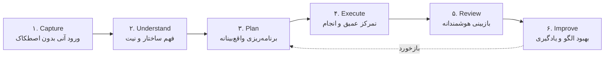
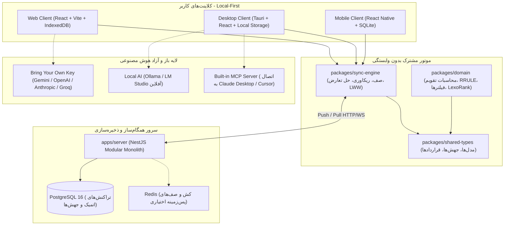
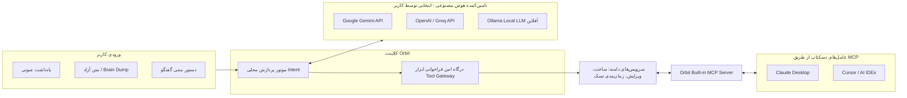
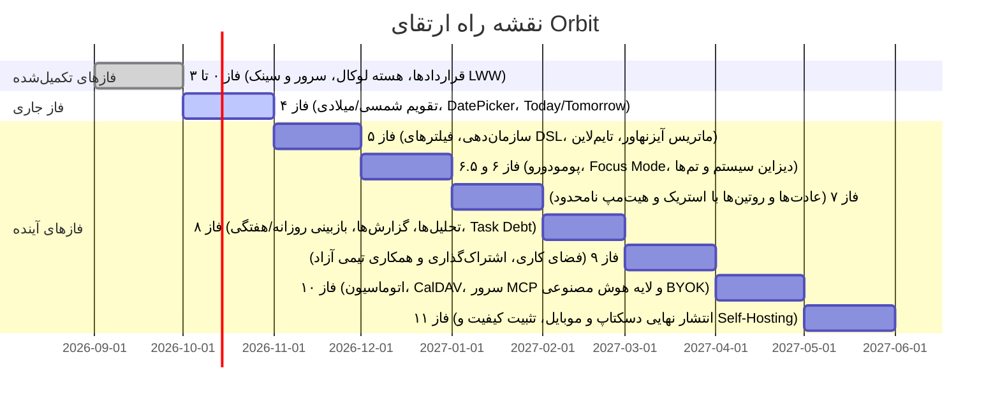

# سند جامع معماری محصول و استراتژی فنی Orbit
## پلتفرم متن‌باز و آزاد بهره‌وری شخصی (FOSS Personal Productivity OS)
### رقیب مستقیم و آزاد TickTick، Todoist و Motion با تمرکز بر تقویم دوگانه (شمسی/میلادی)، Local-First و AI بدون هزینه تحمیلی

---

## ۱. خلاصه اجرایی و فلسفه وجودی (Executive Summary & Manifesto)

### ۱.۱ مسئله و فرصت بازار
بسیاری از کاربران برای مدیریت کارهای روزمره، عادات، زمان و تمرکز خود نیازمند استفاده هم‌زمان از چندین ابزار (Todoist برای تسک، Google Calendar برای زمان، Forest برای پومودورو، Habitica برای عادت و Notion برای یادداشت) هستند. ابزارهای جامع نظیر **TickTick** توانسته‌اند این قابلیت‌ها را گرد هم آورند، اما با چندین چالش بزرگ همراه هستند:
1. **پِی‌وال‌های پولی سنگین ($49.99/سال):** نماهای کاربردی تقویم (هفتگی/ماهانه)، تایم‌لاین، ماتریس آیزنهاور، ردیاب عادت فراتر از ۵ عدد، فیلترهای هوشمند نامحدود و تم‌ها قفل شده‌اند.
2. **عدم پشتیبانی بومی از تقویم شمسی (Jalali):** هیچ‌یک از رقبای بین‌المللی از تقویم خورشیدی، شروع هفته از شنبه، نام‌های فارسی و الگوریتم‌های دقیق سال‌های کبیسه پشتیبانی بومی نمی‌کنند.
3. **وابستگی شدید ابری و عدم حریم خصوصی کامل:** داده‌های زندگی و کارهای کاربر روی سرورهای بسته نگهداری می‌شوند و امکان Self-Host وجود ندارد.
4. **هوش مصنوعی گران و محدودشده:** سرویس‌های AI به شکل بسته‌های اشتراکی پولی ارائه می‌شوند و امکان اتصال کلید اختصاصی کاربر (BYOK) یا مدل‌های لوکال (Ollama) وجود ندارد.

### ۱.۲ ماموریت Orbit
> **Orbit یک پلتفرم متن‌باز، آزاد (Free & Open Source) و محلی‌محور (Local-First) است که تمامی قابلیت‌های پیشرفته و پولی ابزارهای تراز اول دنیا را به‌صورت ۱۰۰٪ رایگان، بدون سقف و بدون قفل نرم‌افزاری در اختیار کاربران قرار می‌دهد؛ با تجربه درجه یک در وب، دسکتاپ و موبایل و پشتیبانی بی‌نقص از زبان فارسی و تقویم شمسی/میلادی.**

---

## ۲. مدل مفهومی چرخه بهره‌وری (The 6-Stage Productivity Loop)

برخلاف اپلیکیشن‌های سنتی که صرفاً یک «فهرست کار» (Todo List) هستند، Orbit بر پایه یک چرخه زنده ۶ مرحله‌ای معماری می‌شود:



1. **Capture (ثبت سریع):** کمترین اصطکاک ممکن. باز کردن برنامه، فشردن کلید میانبر، نوشتن عنوان و زدن اینتر (`Type → Enter`). پشتیبانی از ورودی صوتی، متن ساختارنیافته و ذخیره در Inbox بدون اجبار به تعیین پیش‌فرض‌ها.
2. **Understand (درک و ساختاردهی):** تشخیص طبیعی تاریخ‌ها (مثلاً «فردا ساعت ۱۰» یا "tomorrow at 5pm")، برچسب‌ها، اولویت‌ها و در صورت استفاده از AI، تبدیل تصویر/صوت به تسک با متادیتا.
3. **Plan (برنامه‌ریزی واقع‌بینانه):** ترکیب تقویم و تسک‌ها. زمان‌بندی در تقویم (Time Blocking)، ماتریس آیزنهاور و تایم‌لاین، همراه با **«برنامه‌ریزی صادقانه» (Honest Planning)** که ظرفیت واقعی روزانه را به کاربر یادآوری می‌کند (جلوگیری از برنامه‌ریزی بیش از حد ظرفیت).
4. **Execute (اجرای متمرکز):** هدایت کاربر به سمت انجام کار با Focus Mode، تایمر پومودورو متصل به تسک، حذف پارازیت‌های بصری و هشدارهای پایان بازه کاری.
5. **Review (بازبینی پیوسته):** ماژول‌های بازبینی روزانه و هفتگی (Daily / Weekly Review). پاسخ به این پرسش‌ها: چه کارهایی انجام شد؟ چه کارهایی عقب افتاد؟ زمان تمرکز کجا مصرف شد؟
6. **Improve (شناخت و کاهش بدهی):** سنجش «بدهی کارها» (Task Debt) و شناسایی تسک‌هایی که مکرراً به تعویق می‌افتند، تخمین واقع‌بینانه‌تر زمان برای کارهای آینده و تحلیل روند استمرار عادت‌ها.

---

## ۳. معماری کلان و پشته فناوری (Technical Stack)

Orbit یک سیستم چندکلاینتی Local-First با یک سرور همگام‌ساز سبک و مستقل است:



### ۳.۱ جدول تصمیم‌های فنی نهایی (Architecture Decisions)

| لایه | فناوری انتخابی | توجیه فنی در مقایسه با گزینه‌ها |
| :--- | :--- | :--- |
| **Monorepo** | npm Workspaces + TypeScript Strict | یکپارچگی بدون نیاز به ابزارهای پیچیده شخص ثالث؛ قابل ارتقا به Turborepo در صورت افزایش پکیج‌ها |
| **کلاینت وب** | **React + Vite SPA** | برای برنامه‌های Local-first و آفلاین، استفاده از SPA سبک‌ترین و سریع‌ترین کارایی را دارد. بر خلاف Next.js، هیچ تداخلی با SSR و IndexedDB وجود ندارد. |
| **کلاینت دسکتاپ** | **Tauri + React** | مصرف رم بسیار ناچیز (کمتر از ۵۰ مگابایت در برابر ۵۰۰ مگابایت Electron)، دسترسی بومی به Tray، Global Shortcuts و نوتیفیکیشن‌ها. |
| **کلاینت موبایل** | **React Native** | قابلیت اشتراک قراردادها و منطق کلاینت با وب، دسترسی به نوتیفیکیشن‌های بومی و SQLite محلی. |
| **بک‌اند سرور** | **NestJS Modular Monolith** | معماری ماژولار و ساختاریافته، TypeORM با مایگریشن‌های صریح، پشتیبانی داخلی از WebSocket و تست‌پذیری بالا. |
| **پایگاه داده سرور** | **PostgreSQL** | پشتیبانی قوی از JSONB، ایندکس‌های کامل، تراکنش‌های ACID و مقیاس‌پذیری اثبات‌شده. |
| **پایگاه داده لوکال** | **IndexedDB (Web/Desktop) / SQLite (Mobile)** | تضمین دسترسی آفلاین ۱۰۰٪؛ انجام تمام عملیات خواندن و نوشتن ابتدا در پایگاه داده محلی. |
| **موتور همگام‌سازی** | **Custom Sync Engine با صف FIFO و LWW** | عدم وابستگی به ارائه‌دهندگان ابری پولی (مانند Firebase). مدیریت اتمیک Tombstone، تله‌متری بدون افشای محتوا و ریکاوری خودکار. |

---

## ۴. بازآرایی و رایگان‌سازی قابلیت‌های پولی تیک‌تیک (FOSS Advantage)

در تیک‌تیک و رقبا، فیچرهای زیر پولی هستند. در Orbit تمامی این قابلیت‌ها به عنوان **حقوق اساسی کاربر** به‌صورت رایگان و آزاد پیاده می‌شوند:

### ۴.۱ تقویم جامع دوگانه (شمسی / جلالی + میلادی)
* **ویژگی‌های رایگان Orbit:**
  - نماهای تقویم: روزانه (Day)، ۳ روزه (Multi-day)، هفتگی (Week)، ماهانه (Month)، سالانه (Year) و Agenda.
  - پشتیبانی کامل از تقویم خورشیدی بر اساس الگوریتم ۳۳ ساله برکوفسکی (دقت تا ۲۵۰۰ سال آینده بدون وابستگی خارجی).
  - انتخاب‌گر تاریخ دوگانه (Dual DatePicker) با سوئیچ آنی با یک کلیک بین تقویم شمسی و میلادی.
  - بلوک‌بندی زمانی (Time Blocking) با کشیدن و رها کردن (Drag & Drop) تسک‌ها در روز و ساعت دلخواه.
  - پشتیبانی از اتصال تقویم‌های خارجی از طریق استانداردهای باز (CalDAV و اشتراک iCal/ICS).

### ۴.۲ ماتریس آیزنهاور سفارشی (Eisenhower Matrix)
* **معماری:** ماتریس آیزنهاور در Orbit یک جدول مجزا در دیتابیس نیست، بلکه یک **نمای مشتق‌شده (Derived View)** است که از ترکیب اولویت (`priority`) و تاریخ سررسید (`dueDate`) و قوانین دلخواه کاربر تولید می‌شود:
  - ربع ۱: فوری و مهم (Do First)
  - ربع ۲: مهم و غیرفوری (Schedule)
  - ربع ۳: فوری و غیرمهم (Delegate)
  - ربع ۴: غیرفوری و غیرمهم (Eliminate)
* **مزیت Orbit:** جابه‌جایی تسک بین ربع‌ها بلافاصله فیلدهای متناظر تسک را بدون تغییر ساختار داده به‌روزرسانی می‌کند.

### ۴.۳ تایم‌لاین و گانت سبک (Timeline View)
* نمایش کارهای دارای مدت‌زمان (`duration`) و تاریخ شروع و پایان بر روی یک محور پیوسته زمانی.
* تنظیم مدت‌زمان کارها با کشیدن لبه‌های تسک (Resize Duration) در وب و دسکتاپ.

### ۴.۴ ردیاب عادت‌ها و روتین‌ها (Habit Tracker بدون محدودیت)
* بر خلاف تیک‌تیک که کاربر رایگان را به ۵ عادت محدود می‌کند، در Orbit:
  - تعداد عادات **نامحدود** است.
  - پشتیبانی از انواع اهداف: روزانه، روزهای خاص هفته، یا تعداد دفعات در هفته.
  - محاسبه زنجیره تکرار (Streaks)، نرخ استمرار و تقویم هیت‌مپ گیت‌هابی (GitHub-style Heatmap).
  - اتصال اختیاری عادت به تسک و شروع تایمر تمرکز از روی عادت.

### ۴.۵ موتور فیلترهای هوشمند مبتنی بر JSON Rule DSL
کاربر می‌تواند هر تعداد فیلتر و لیست هوشمند دلخواه با شرایط پیچیده منطقی (AND / OR) بسازد. ساختار قوانین به‌صورت خنثی از پلتفرم ذخیره می‌شود:

```json
{
  "operator": "AND",
  "rules": [
    { "field": "priority", "operator": "gte", "value": 3 },
    { "field": "dueDate", "operator": "within", "value": "this_week" },
    { "field": "tags", "operator": "contains", "value": "deep-work" }
  ]
}
```

### ۴.۶ رتبه‌بندی کسری (Fractional Indexing / LexoRank)
برای مرتب‌سازی آیتم‌ها در لیست‌ها و بورد کانبان، از ایندکس‌های عدد صحیح استفاده نمی‌شود (زیرا جابه‌جایی یک آیتم مستلزم به‌روزرسانی هزاران رکورد است). در Orbit از **رتبه‌بندی رشته‌ای لکسیکوگرافیک (مانند `a0`, `a1`, `a0:V`)** استفاده می‌شود تا هر جابه‌جایی تنها با ویرایش فیلد `position` یک رکورد سینک شود.

---

## ۵. استراتژی باز و انقلابی هوش مصنوعی (Open-Source AI Strategy)

در یک پروژه متن‌باز، تحمیل هزینه توکن API سرور مرکزی به توسعه‌دهندگان پروژه غیرممکن است. راه‌حل انقلابی Orbit سه‌گانه زیر است:



### ۵.۱ مدل کلید اختصاصی کاربر (BYOK - Bring Your Own Key)
* کاربر API Key شخصی خود (مانند Gemini که سهمیه رایگان بسیار سخاوتمندانه‌ای دارد، یا OpenAI/Groq/OpenRouter) را داخل کلاینت ذخیره می‌کند.
* کلیدها فقط روی دستگاه کاربر ذخیره می‌شوند و هرگز به سرور اوربیت ارسال نمی‌شوند.

### ۵.۲ پشتیبانی از هوش مصنوعی کاملاً آفلاین (Local LLMs)
* اتصال مستقیم کلاینت دسکتاپ و وب به endpoint لوکال **Ollama** یا **LM Studio** (`http://localhost:11434`).
* کاربران دارای سخت‌افزار مناسب یا نگران حریم خصوصی می‌توانند از مدل‌های سبکی چون `Llama 3`, `Qwen 2.5` یا `Gemma 2` برای درک متن، شکستن کارها و خلاصه‌سازی بدون یک بایت تبادل دیتا با اینترنت استفاده کنند.

### ۵.۳ درگاه امن ابزارها (AI Tool-Calling Gateway)
مدل‌های زبانی هرگز دسترسی مستقیم به پایگاه داده ندارند. AI صرفاً می‌تواند ابزارهای تعریف‌شده در لایه دامنه را با تایید کاربر فراخوانی کند:
* `create_task(title, dueDate, priority, tags, duration)`
* `break_down_task(taskId, subtasks[])`
* `suggest_schedule(tasks[], calendarSlots[])`
* `review_capacity(day)`

### ۵.۴ سرور محلی پروتکل MCP (Model Context Protocol)
اوربیت دارای یک سرور داخلی MCP خواهد بود. این یعنی کاربر می‌تواند در **Claude Desktop** یا **Cursor** تایپ کند:
> *«تسک‌های امروز من در Orbit را بررسی کن و جلسات تداخلی را به بعدازظهر منتقل کن.»*
و مدل از طریق پروتکل رسمی MCP دستورات را در اوربیت اعمال می‌کند.

---

## ۶. برنامه‌ریزی واقع‌بینانه و شاخص‌های بهره‌وری واقعی

### ۶.۱ مفهوم برنامه‌ریزی صادقانه (Honest Capacity Planning)
بسیاری از کاربران با لیست‌های بلندبالای ۲۰ تسک در روز دچار فرسودگی می‌شوند. اوربیت با مقایسه فیلد `duration` تسک‌ها با زمان‌های آزاد تقویم، شاخص بار کاری روزانه را محاسبه می‌کند:
$$\text{Workload} = \sum \text{Task Duration} \quad \text{vs} \quad \text{Available Calendar Time}$$
اگر کارها بیش از ظرفیت روزانه باشد، سیستم به جای تشویق کاذب هشدار می‌دهد:
> ⚠️ **ظرفیت امروز تکمیل است:** شما برای امروز ۶ ساعت کار برنامه‌ریزی کرده‌اید در حالی که طبق تقویم تنها ۳ ساعت و نیم زمان خالی دارید. پیشنهاد می‌شود ۲ تسک با اولویت پایین‌تر به فردا موکول شوند.

### ۶.۲ بدهی بهره‌وری (Task Debt)
سیستم تسک‌هایی را که بیش از ۳ بار جابه‌جا و به تعویق افتاده‌اند شناسایی کرده و به کاربر پیشنهاد اقدام اصلاحی می‌دهد (تقسیم به زیرکارهای کوچک‌تر، تفویض، یا حذف شجاعانه کار).

---

## ۷. ساختار یکپارچه Monorepo و مرزهای مسئولیت

```
orbit/
├── apps/
│   ├── web/           # کلاینت وب React + Vite SPA با دسترسی IndexedDB
│   ├── desktop/       # کلاینت Windows/Linux با فریم‌ورک سبک Tauri
│   ├── mobile/        # کلاینت Android با React Native
│   └── server/        # سرور NestJS Modular Monolith + Postgres + Sync Endpoints
│
├── packages/
│   ├── shared-types/  # تعاریف خنثی TypeScript (موجودیت‌ها، جهش‌ها، قراردادها)
│   ├── sync-engine/   # موتور صف همگام‌سازی محلی، حل تعارض LWW و تله‌متری
│   ├── domain/        # هسته خالص بیزینس لاجیک: تقویم شمسی/میلادی، RRULE، فیلترها و رتبه‌بندی
│   └── ui-system/     # توکن‌های دیزاین سیستم و کامپوننت‌های بصری اشتراکی
│
└── docs/              # مستندات پایدار و منبع حقیقت معماری
```

---

## ۸. تطبیق با نقشه راه فازبندی‌شده Orbit

پروژه بدون برهم زدن ساختار جاری، قابلیت‌های غنی سند را به شکل فازبندی‌شده در برنامه جای می‌دهد:



---

## ۹. جمع‌بندی نهایی

این سند مسیر Orbit را به گونه‌ای تثبیت می‌کند که:
1. **هویت اوپن‌سورس و رایگان بودن** پروژه حفظ و تقویت می‌شود؛ کاربران به تمام امکانات گران‌قیمت تیک‌تیک دسترسی دارند بدون آنکه هزینه‌ای متوجه توسعه‌دهندگان پروژه شود.
2. **پشتیبانی بومی از تقویم شمسی و زبان فارسی** یک مزیت رقابتی غیرقابل شکست در برابر تمامی رقبای غربی ایجاد می‌کند.
3. **معماری Local-First** حریم خصوصی، سرعت خیره‌کننده و دسترسی بدون وقفه در شرایط قطعی اینترنت را تضمین می‌نماید.
